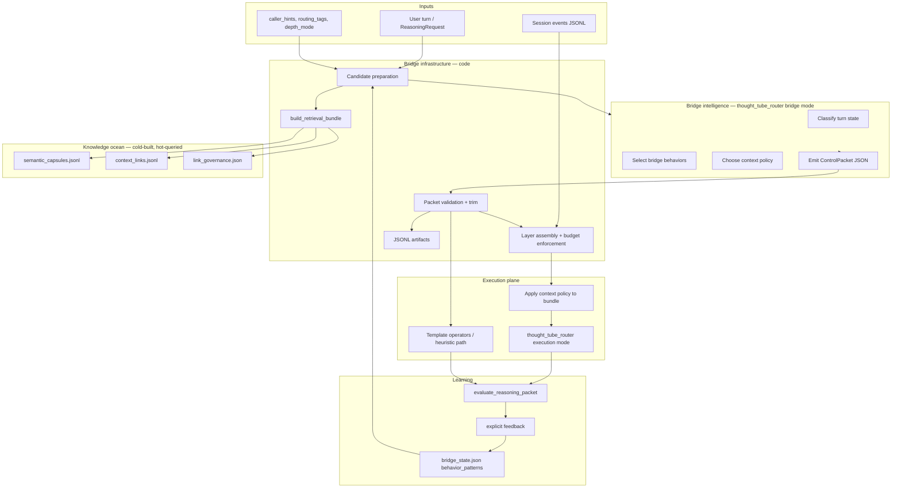

# Agent Bridge — Architecture

Date: 2026-06-25

Related:

- [Summary](00-summary.md)
- [Component readiness](02-component-readiness.md)
- [State-Dependent Reasoning Architecture](../../product-thesis/07-state-dependent-reasoning-architecture.md)
- [Chat Bridge Requirements](../../product-thesis/03-chat-bridge-requirements.md)

---

## System overview



---

## Design principles

1. **Infrastructure prepares; agent judges.** Code fetches candidates and enforces hard limits. The agent selects among bounded options.
2. **Strict handoff.** Execution never runs without a validated `ControlPacket`.
3. **Fail soft, fail closed.** Agent failure → heuristic bridge. Weak context → degrade depth, do not invent memory.
4. **Inspectable by default.** Every turn produces a packet artifact with provenance.
5. **Modular behaviors.** Posture modifiers are data, not scattered conditionals.
6. **Same protocol everywhere.** CLI, thought chat, and miniapp share one bridge entrypoint.

---

## Part 1 — Evidence and request ingress

### `ReasoningRequest`

**Owner:** `src/conversation_os/models.py`  
**Entry:** `reasoning run` CLI, future live surfaces

| Field | Role |
|-------|------|
| `raw_text` | Primary turn evidence |
| `session_id` | Session-local layer key |
| `caller_hints` | Explicit routing, depth, behaviors, feedback |
| `domain_hints` | Dimension activation |
| `source_refs` | Provenance anchors |

Hashtags in text (e.g. `#meta`, `#metathought`) are parsed into `caller_hints.routing_tags` by CLI.

**Responsibility:** Capture append-only evidence. Never overwrite prior interpretation in place.

---

## Part 2 — Bridge infrastructure (`reasoning_bridge.py`)

The deterministic integration layer. Owns assembly, budgets, and persistence. Does **not** own final classification when agent mode is enabled.

### 2a. Candidate preparation (new responsibility)

Before agent invocation, infrastructure builds a **candidate package**:

```json
{
  "turn": { "raw_text": "...", "session_id": "...", "caller_hints": {} },
  "heuristic_preview": { "...": "optional classify_turn heuristic output" },
  "session_preview": [ "... last N events ..." ],
  "retrieval_candidates": {
    "seed_capsules": [],
    "related_capsules": [],
    "anchor_pond": "",
    "alias_hits": []
  },
  "behavior_menu": [ "... declarative behavior specs ..." ],
  "user_patterns": [ "... from bridge_state ..." ],
  "workspace": { "workspace_id": "", "thought_id": "" }
}
```

This package is the **only** material the bridge-mode agent sees from the ocean. It does not query the graph itself.

### 2b. `classify_turn` (evolving)

**Today:** Pure heuristics — token extraction, keyword goals, `BRIDGE_BEHAVIOR_RULES` matching.

**Target:**

```
if bridge.enabled and agent reachable:
    packet = bridge_controller.classify_with_agent(candidates)  # validated ControlPacket
else:
    packet = heuristic_classify_turn(...)  # current logic, mapped to ControlPacket shape
```

Heuristic path remains permanent fallback.

### 2c. `get_context_bundle`

Assembles four layers with depth budgets:

| `depth_mode` | Session | User patterns | Global retrieval |
|--------------|---------|---------------|------------------|
| `focused` | 4 events | up to 2 | off |
| `contextual` | 8 | up to 4 | on (6 caps / 4 neighbors) |
| `deep` | 12 | up to 6 | on + cross-pond |
| `incognito` | 0 | 0 | off |

**Layers:**

| Key | Source |
|-----|--------|
| `session_local` | `memory/events/{session_id}.jsonl` |
| `workspace_local` | workspace id, thought_id, optional `thread_packet` |
| `user_local` | `bridge_state.json` patterns + personalization |
| `global_fallback` | `build_retrieval_bundle(active_topic, ...)` |

`bundle_layers` on `ContextState` records which layers were included.

### 2d. Context switch detection

Compares current `ContextState` to previous session context:

- `workspace_shift`
- `object_shift`
- `field_reshape`
- `local_adjustment`

Writes `context_switch_events.jsonl` with rollback path and retrieval source refs.

### 2e. Persistence

| Artifact | Path |
|----------|------|
| Context states | `.../reasoning_runtime/context_states.jsonl` |
| Context switches | `.../reasoning_runtime/context_switch_events.jsonl` |
| Control packets (new) | `.../reasoning_runtime/control_packets.jsonl` |

---

## Part 3 — Bridge intelligence (`bridge_controller.py`, proposed)

### Role

Invoke `thought_tube_router` in **bridge mode** to produce a `ControlPacket`.

### Invocation pattern (mirrors existing assist)

Follow `context_bubbles._run_bubble_assist` and `chat_backends.request_openclaw_reply`:

```bash
openclaw agent \
  --agent thought_tube_router \
  --thinking low \
  --message "<bridge prompt>" \
  --json
```

### Bridge prompt structure

1. Role: control-plane only, JSON output, do not answer user
2. Turn text and session preview
3. Heuristic preview (optional hint, not authority)
4. Retrieval candidate summaries (labels, types, scores — not full corpus)
5. Behavior menu with IDs and descriptions
6. User pattern summary
7. JSON schema for `ControlPacket`

### Response handling

1. Parse JSON from stdout (reuse `_extract_assist_json` patterns)
2. Validate against `ControlPacket` schema
3. Clamp `context_policy` to allowed budgets
4. Filter `bridge_behaviors` to known behavior IDs
5. On failure → heuristic `classify_turn` + default policy

### Config (`runtime.json` bridge section, proposed)

```json
{
  "bridge": {
    "enabled": true,
    "agent": "thought_tube_router",
    "thinking": "low",
    "timeout_seconds": 25,
    "fallback": "heuristic",
    "emit_heuristic_preview": true,
    "behavior_specs_dir": "product/inner_world_v1/config/bridge_behaviors"
  }
}
```

Env overrides: `INNER_WORLD_BRIDGE_ENABLED`, `INNER_WORLD_BRIDGE_AGENT`, etc.

---

## Part 4 — Control packet contract (new)

### `ContextPolicy`

| Field | Purpose |
|-------|---------|
| `mode` | `none`, `recent_local`, `semantic_narrow`, `graph_contextual`, `cross_ocean_exploration`, `evidence_strict` |
| `depth_mode` | `focused`, `contextual`, `deep`, `incognito` |
| `token_budget` | Max disclosure budget (infrastructure enforces) |
| `include_layers` | Which bundle layers to disclose to execution |
| `exclude_layers` | Explicit exclusions (e.g. unapproved sidecars) |
| `cross_ocean` | Allow cross-pond neighbor expansion |
| `retrieval_limit` | Capsule count cap |
| `neighbor_limit` | Link walk cap |

Infrastructure **must** clamp agent proposals to hard maximums.

### `ControlPacket`

Minimal shape (extends architecture doc 07):

```json
{
  "packet_id": "pkt-...",
  "request_id": "req-...",
  "active_topic": "...",
  "object_scope": "same_main | new_main | parallel_object | sub_object",
  "object_id": "...",
  "parent_object_id": "...",
  "dimension_axis": "",
  "user_goal": "explore | understand | build | evaluate",
  "current_tension": "",
  "reasoning_posture": "expansive | evaluative | implementation | ...",
  "factual_anchor_level": "low | medium | high",
  "bridge_behaviors": ["creative_expansion"],
  "pipeline_id": "intuition_expansion_v1",
  "context_policy": { "...": "..." },
  "steering_constraints": ["preserve provenance", "..."],
  "confidence": 0.82,
  "routing_source": "agent | heuristic | hybrid",
  "attributes": {}
}
```

`ControlPacket` replaces implicit state scattered across `ContextState.attributes`.

Mapping:

- `ControlPacket` → drives `get_context_bundle` budget overrides
- `ControlPacket` → drives `route_reasoning` / `suggested_reasoning_family`
- `ControlPacket` → passed to execution plane verbatim (trimmed)

---

## Part 5 — Active field (`active_field.py`)

Transforms control state + context bundle into operator/agent input shape.

| Output | Source |
|--------|--------|
| `candidate_parent_ideas` | Retrieval seed/related capsules |
| `fragment_role` | Text heuristics + packet hints |
| `ambiguity_level` | Parent idea count + language markers |
| `suggested_reasoning_family` | Bridge behaviors override > packet `pipeline_id` |
| `retrieval_bundle_summary` | Counts, anchor_pond, alias hits |
| `bridge_behaviors` | From control packet |

Embeds full `context_bundle` in `attributes` for inspectability.

**Thread perturbation:** `caller_hints.thought_id` → `build_thread_packet()` adds meta + chunk excerpts to workspace layer.

---

## Part 6 — Knowledge ocean and retrieval (`knowledge_layer.py`)

### Cold path (build)

`library_tracker.derive_graph` materializes:

`chunks → analysis_units → meta_layer → threads → bubbles → knowledge_layer → semantic_capsules + context_links`

### Hot path (query)

`build_retrieval_bundle(query, limit, neighbor_limit, include_cross_pond)`:

1. Token-score all capsules (with type weights)
2. Resolve alias hits via `link_governance.json`
3. Anchor pond from top pond scores
4. Select seed capsules (pond-bounded)
5. Walk `context_links.jsonl` for neighbors
6. Return seeds, related, links, source_refs

**Critical fix required:** All `_capsules_path`, `_nodes_path`, etc. must use `product_runtime_dir(root, "inner_world_v1", "data")` not hardcoded `product/`.

### Ocean scale (verified)

| Environment | Capsules | Path alignment |
|-------------|----------|----------------|
| Server | ~108k | `product/` — works today |
| Local dev | ~108k | `runtime/product_state/` — broken for `knowledge_layer` |

---

## Part 7 — Bridge behaviors (modular specs)

### Today

Four behaviors in `BRIDGE_BEHAVIOR_RULES` dict inside `reasoning_bridge.py`:

| ID | Pipeline | Mode |
|----|----------|------|
| `creative_expansion` | `intuition_expansion_v1` | override |
| `symbolic_interpretation` | `symbolic_interpretation_v1` | override |
| `objective_evaluation` | `candidate_evaluation_v1` | override |
| `implementation_scaffold` | `idea_embedding_v1` | bias |

Each carries `response_directives`, `operator_biases`, `priority`.

### Target

JSON files under `product/inner_world_v1/config/bridge_behaviors/*.json`:

```json
{
  "behavior_id": "creative_expansion",
  "priority": 90,
  "preferred_pipeline": "intuition_expansion_v1",
  "routing_mode": "override",
  "reasoning_posture": "expansive",
  "response_directives": [],
  "operator_biases": {},
  "match_hints": ["metathought", "interpretive_language"]
}
```

Agent receives behavior menu as structured list. Infrastructure validates selected IDs.

Confirmed patterns in `bridge_state.json` (`bridge_behavior:{id}`) bias future matching.

---

## Part 8 — Routing (`reasoning_router.py`)

Selects `pipeline_id` from `ActiveFieldState`:

1. Highest-priority bridge behavior with `routing_mode: override` wins
2. Else `fragment_role == candidate_evaluation` → `candidate_evaluation_v1`
3. Else high ambiguity + few parents → `problem_reframing_v1`
4. Else `suggested_reasoning_family`

**With agent bridge:** `ControlPacket.pipeline_id` sets primary route; router becomes validator/enforcer.

---

## Part 9 — Execution plane

### Target (agent-backed)

```
trim_context_bundle(context_bundle, control_packet.context_policy)
execution_message = compose_execution_message(packet, trimmed_bundle, user_text)
request_openclaw_reply(root, context, user_message, thread, backend)
```

`compose_openclaw_message` today is thought-chat-specific. New `compose_execution_message` includes control packet steering constraints.

### Fallback (current)

`pipeline_runner.run_pipeline` → `operators.py` template responses.

Keep fallback when:

- `bridge.execution_mode: operators`
- Agent execution times out
- `incognito` depth mode

---

## Part 10 — Evaluation and learning

### Evaluation (`reasoning_evaluator.py`)

Produces `integration_verdict`: `integrate`, `needs_more_probe`, `preserve_tension`, `reject`, `suspend`.

### Learning (`reasoning_learning.py` + `bridge_state.json`)

On explicit feedback (`accept`, `reframe`, `prefer`, `confirm`):

1. `record_learning_event` → `reasoning_learning_events.jsonl`
2. `persist_bridge_behavior_preferences` → `bridge_behavior:{id}` patterns in `bridge_state.json`

One-off behavior must not immediately rewrite durable model (per chat bridge requirements).

---

## Part 11 — OpenClaw integration

### Server topology (verified)

| Component | Location |
|-----------|----------|
| OpenClaw workspace | `/home/talha/.openclaw/workspace` |
| Inner World repo | `.../containers/inner-world` |
| Miniapp host | port 3010 |
| Inner World backend | port 8422 |
| GPT bridge | port 8093 (repo tools — separate from ocean bridge) |

### Agents (verified on server)

| Agent ID | Role |
|----------|------|
| `thought_tube_router` | Default chat + target bridge intelligence |
| `inner_world_dimension_fast` | Chunk evidence posture |
| `inner_world_dimension_semantic` | Semantic enrichment |
| `inner_world_dimension_judge` | Escalation arbitration |

### Existing OpenClaw call sites (patterns to reuse)

| Module | Use |
|--------|-----|
| `chat_backends.request_openclaw_reply` | Thought chat execution |
| `context_bubbles._run_bubble_assist` | Bounded JSON assist |
| `thought_factory` | Thought surfacing assist |
| `library_tracker` | Dimension / pond classification |

**None** currently call bridge classification.

---

## Part 12 — Surfaces (target wiring)

Single bridge entrypoint: `run_reasoning(root, request)` (or thin wrapper).

| Surface | Today | Target |
|---------|-------|--------|
| `reasoning run` CLI | Heuristic bridge | Agent bridge + fallback |
| `chat_with_thought` | Direct OpenClaw, no bridge | `run_reasoning` → execution |
| Miniapp chat API | Same as thought chat | Same bridge entry |
| Mobile surface | Partial | Same bridge entry |

---

## Part 13 — Inspectability

Per turn artifacts:

| Artifact | Contents |
|----------|----------|
| `control_packets.jsonl` | Full packet + routing_source |
| `context_states.jsonl` | Resolved ContextState |
| `active_fields.jsonl` | Field + retrieval summary |
| `reasoning_results.jsonl` | Response + verdict |
| `context_switch_events.jsonl` | Switches with retrieval refs |

CLI target: `reasoning inspect --request-id <id>` prints packet, layers, agent rationale.

---

## Data flow (end-to-end target)

```
ReasoningRequest
  → prepare_candidates()           # code: retrieval, session, behavior menu
  → bridge_controller.classify()   # agent: ControlPacket (or heuristic fallback)
  → validate_and_clamp(packet)     # code
  → get_context_bundle(packet)     # code: apply ContextPolicy
  → build_active_field()           # code
  → route_reasoning()              # code: enforce pipeline_id
  → execute(packet, bundle)        # agent execution OR operator fallback
  → evaluate_reasoning_packet()      # code
  → record_learning_event()        # optional, on feedback
  → persist all artifacts          # code
```

---

## Module map

| Module | Plane | Status |
|--------|-------|--------|
| `reasoning_bridge.py` | Infrastructure | Exists, needs agent hook + path fix |
| `bridge_controller.py` | Agent bridge | **Proposed** |
| `knowledge_layer.py` | Ocean query | Exists, needs path fix |
| `active_field.py` | Integration | Exists |
| `reasoning_router.py` | Routing | Exists |
| `reasoning_runtime.py` | Orchestrator | Exists |
| `reasoning_evaluator.py` | Evaluation | Exists |
| `reasoning_learning.py` | Learning | Exists |
| `chat_backends.py` | OpenClaw exec | Exists, needs execution composer |
| `operators.py` | Fallback exec | Exists |
| `personal_interface.py` | bridge_state | Exists |
| `models.py` | Contracts | Needs ControlPacket types |

---

## Architecture statement

The bridge is a **modular context assembly and integration platform**. Code owns the ocean query, budgets, provenance, and persistence. `thought_tube_router` owns judgment over a bounded candidate field and emits a strict control packet. Execution happens inside that packet — never outside it.
