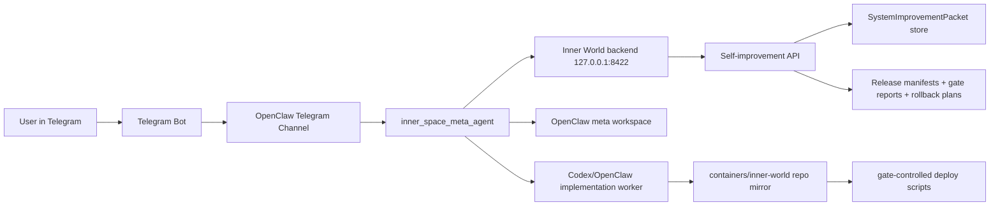

# Telegram Meta Agent Implementation Spec

## Decision

Meta mode should move out of the notes app.

The notes app should remain the thought capture surface. System editing should happen through a dedicated Telegram-connected OpenClaw agent that can discuss, classify, package, test-gate, and promote changes to Inner Space without turning the mobile app into an admin console.

Telegram is the ingress. OpenClaw is the agent/runtime substrate. Inner World remains the product backend and release authority.

## Sources Read

- `docs/plans/2026-04-14-inner-world-openclaw-server-architecture.md`
- `docs/plans/2026-04-14-inner-world-openclaw-runtime.md`
- `docs/plans/2026-04-23-bounded-openclaw-semantic-assist-architecture.md`
- `docs/implementation/self-improvement-agent/README.md`
- `docs/superpowers/plans/2026-06-29-self-improvement-agent-implementation-plan.md`
- `docs/guides/deployment-guide.md`
- `product/inner_world_v1/releases/README.md`
- `product/inner_world_v1/config/agent_configs/thought_tube_self_improve.json`
- `src/conversation_os/self_improvement.py`
- `src/conversation_os/release_management.py`
- `src/conversation_os/miniapp.py`
- local OpenClaw workspace and Telegram agent configuration, with secrets intentionally excluded from this spec

## Product Role

The Telegram meta agent is the system-editing assistant for Inner Space.

It accepts prompts like:

- "make the capture reply shorter"
- "change the app behavior so meta is not visible"
- "fix the iPhone layout"
- "harden deploy rollback"
- "update the bridge personality"
- "run the tests and deploy if safe"

It should answer conversationally, but its core job is not chat. Its core job is to turn product feedback into controlled change work.

## App Surface Change

The in-app `meta` tab should be retired as a primary control surface.

Implementation expectation:

- Remove the visible `meta` chip from the notes PWA.
- Keep `/meta` as a safe informational fallback or redirect target during transition.
- The fallback should say that system editing now happens through the Telegram meta agent.
- Do not embed the self-improvement console in the PWA.
- Do not keep two active meta surfaces once Telegram is live.

The notes app should have one job: capture thought and show assistant replies in the normal flow.

## Non-Goals

- It is not a general Telegram assistant.
- It does not replace Codex for implementation.
- It does not mutate production directly from a casual message.
- It does not bypass tests, review gates, release manifests, or rollback planning.
- It does not become the normal note-taking or thought-capture surface.
- It does not expose private repo or memory content into Telegram unless the user explicitly asks for a relevant summary.

## High-Level Topology



## Server Workspace

The live server already treats Inner World as an OpenClaw subsystem under:

- OpenClaw workspace root: `/home/talha/.openclaw/workspace`
- Live repo path: `/home/talha/.openclaw/workspace/containers/inner-world`
- Backend service: `inner-world.service`
- Backend address: `127.0.0.1:8422`
- Notes surface host: `notes.talhaslaboratory.xyz`

Add a dedicated meta-agent workspace:

```text
/home/talha/.openclaw/workspace-meta/
  AGENTS.md
  IDENTITY.md
  SOUL.md
  USER.md
  TOOLS.md
  HEARTBEAT.md
  README.md
  state/
    current_focus.json
    active_packets.json
    approval_state.json
    deployment_state.json
  inbox/
    telegram.jsonl
  outbox/
    telegram.jsonl
  packets/
    proposed/
    approved/
    rejected/
  releases/
    candidates/
    gate_reports/
    rollback_plans/
  handoffs/
    codex/
    openclaw/
  logs/
    agent_events.jsonl
    safety_events.jsonl
```

The OpenClaw agent runtime should use:

```text
/home/talha/.openclaw/agents/inner_space_meta/
  agent/
  sessions/
  runtime/
  logs/
```

Do not overload the existing generic Telegram agent workspace. The existing `telegram` agent can remain a general communication participant. The meta agent should be explicitly routed and isolated.

## Repo-Local Product State

Operational Telegram state should stay out of git by default. Product contracts and durable governance artifacts should live in the Inner World repo mirror.

Add these repo-local directories when implementing:

```text
product/inner_world_v1/meta_agent/
  README.md
  schema/
    telegram_meta_message.v1.json
    meta_agent_decision.v1.json
    approval_event.v1.json
  state/
    .gitkeep

product/inner_world_v1/releases/
  <release_id>/
    manifest.json
    gate_report.json
    rollback_plan.json
    post_deploy_smoke.json
```

The repo should keep schemas, policy, and release artifacts. Raw Telegram traffic and private session logs should stay in the OpenClaw agent workspace unless explicitly promoted into a packet as provenance.

## OpenClaw Agent Registration

Add a new OpenClaw agent entry:

```json
{
  "id": "inner_space_meta",
  "name": "Inner Space Meta",
  "workspace": "/home/talha/.openclaw/workspace-meta",
  "agentDir": "/home/talha/.openclaw/agents/inner_space_meta/agent",
  "model": "moonshot/kimi-k2.5"
}
```

Telegram routing should target this agent only for explicit meta commands or allowlisted direct chat.

Implementation should add a config validator that proves:

- `inner_space_meta` is registered.
- Its workspace is not the generic Telegram workspace.
- Its model is explicitly configured.
- It is routable from Telegram commands.
- It is not the default Telegram participant for ordinary non-meta chat.

Recommended routing rules:

- `/meta <message>` routes to `inner_space_meta`
- `/change <message>` routes to `inner_space_meta` in `operate` candidate mode
- `/status` returns current packet/release state
- `/approve <packet_id>` records approval but does not deploy by itself
- `/reject <packet_id>` marks packet rejected
- `/deploy <release_id>` runs the gated runtime deploy and the gated Thought Capture deploy, then records deployment state and post-deploy smoke evidence
- `/rollback <release_id>` currently returns the validated dry-run rollback plan; live rollback execution stays blocked until a dedicated rollback executor exists

## Telegram Connection

Use the existing OpenClaw Telegram channel capability, but configure a separate route to the meta agent.

Required environment:

```text
OPENCLAW_HOME=/home/talha/.openclaw
INNER_SPACE_META_AGENT_ID=inner_space_meta
INNER_SPACE_META_WORKSPACE=/home/talha/.openclaw/workspace-meta
INNER_WORLD_REPO=/home/talha/.openclaw/workspace/containers/inner-world
INNER_WORLD_API_BASE=http://127.0.0.1:8422/api
INNER_WORLD_CAPTURE_HOSTNAME=notes.talhaslaboratory.xyz
TELEGRAM_BOT_TOKEN=<secret, never in repo>
TELEGRAM_ALLOWED_USER_IDS=<comma-separated allowlist>
INNER_SPACE_META_DEFAULT_STATE=discuss
INNER_SPACE_META_ALLOW_DEPLOY=false
INNER_SPACE_META_REQUIRE_APPROVAL=true
```

Secrets belong in a user-level environment file:

```text
/home/talha/.config/inner-space-meta.env
```

The env file must be mode `0600`.

Do not persist bot tokens, chat ids, or user ids in repo docs, tests, packet examples, or release artifacts. Tests should use placeholder ids and injected env values.

## Systemd Services

Add a dedicated service for the Telegram meta bridge:

```ini
[Unit]
Description=Inner Space Telegram Meta Agent
After=network-online.target inner-world.service
Wants=network-online.target

[Service]
Type=simple
EnvironmentFile=%h/.config/inner-space-meta.env
WorkingDirectory=%h/.openclaw/workspace/containers/inner-world
ExecStart=/usr/bin/env python3 tools/run_telegram_meta_agent.py --poll-forever
Restart=on-failure
RestartSec=5

[Install]
WantedBy=default.target
```

Service name:

```text
inner-space-meta-telegram.service
```

For local Codex development on macOS, install a LaunchAgent instead of systemd:

```bash
python3 tools/install_meta_telegram_agent_service.py
```

That writes:

- `~/.config/inner-space-meta.env`
- `~/Library/LaunchAgents/com.inner-space.meta-telegram.plist`

Once `TELEGRAM_BOT_TOKEN` and `TELEGRAM_ALLOWED_USER_IDS` are filled into the env file, start it with:

```bash
python3 tools/install_meta_telegram_agent_service.py --start
```

Health checks:

```bash
systemctl --user is-active inner-world.service
systemctl --user is-active inner-space-meta-telegram.service
curl -fsS http://127.0.0.1:8422/api/runtime-overview
```

## Agent Personality Sheet

Agent id:

```text
inner_space_meta
```

Role:

```text
Specialized product-governance and self-improvement agent for Inner Space.
```

Core posture:

- Quiet, direct, and precise.
- Treat product changes as governed work, not casual suggestions.
- Preserve the user's exact phrasing when it carries product meaning.
- Help the user think before implementation, but do not stall once intent is concrete.
- Prefer small reversible changes over broad rewrites.
- Keep context boundaries explicit: Telegram input, product state, repo evidence, release evidence.
- Never imply a deploy happened unless the gate report, release manifest, and live smoke prove it.

Interaction style:

- For exploratory prompts, stay in `discuss`.
- For explicit change prompts, create or update a `SystemImprovementPacket`.
- For risky changes, state the risk tier and required gates.
- For UI/UX changes, ask for or derive the affected surface, viewport, expected behavior, and smoke path.
- For agent behavior changes, require before/after examples or a golden conversation fixture.
- For backend/deploy changes, require service smoke and rollback.
- For bridge/pipeline changes, require trace comparison and provenance checks.

Forbidden behavior:

- No direct production deploy from an unclassified Telegram message.
- No runtime config mutation without packet, approval, tests, and release record.
- No agent prompt mutation without versioning and golden behavior checks.
- No "looks fixed" claims without live verification.
- No leaking private memory or raw repo content into Telegram unless directly necessary and scoped.

Default response shape:

```text
<brief answer>

Mode: discuss | operate
Domain: ui_ux | agent_behavior | backend_setup | tool_creation | thought_pipeline_config | bridge_work | deployment_release
Risk: none | medium | high | critical
Next: clarify | packet | implement | test | release | deploy | rollback
```

For normal chat, keep the metadata compact. For approvals, deployments, and rollbacks, include the relevant ids.

## Operating Modes

### Discuss

Purpose:

- Think through a possible change.
- Clarify product intent.
- Identify affected layers.
- Avoid creating noisy tasks too early.

Allowed outputs:

- conversational answer
- provisional domain/risk estimate
- suggested scope
- open questions
- optional packet preview

Not allowed:

- code changes
- deployment
- runtime mutation

### Operate

Purpose:

- Convert a concrete request into governed work.

Allowed outputs:

- `SystemImprovementPacket`
- workboard task
- implementation handoff
- gate report request
- release candidate
- rollback plan

Not allowed:

- production deploy unless approval and gates are complete

### Deploy

Purpose:

- Promote an already verified release candidate.

Required:

- approved packet
- release manifest
- passed gate report
- rollback plan
- clean or explicitly accepted git state
- live smoke command list

Current implementation:

- Requires explicit approval for the same `release_id` in the meta workspace state.
- Requires `manifest.json`, `gate_report.json`, and `rollback_plan.json` under `product/inner_world_v1/releases/<release_id>/`.
- Executes:
  - `python3 tools/deploy_inner_world_to_openclaw.py --release-gate-report ...`
  - `python3 tools/deploy_thought_capture_pwa_to_openclaw.py --release-gate-report ...`
- Writes workspace deployment state to `state/deployment_state.json`.
- Writes release evidence to `product/inner_world_v1/releases/<release_id>/post_deploy_smoke.json`.

### Rollback

Purpose:

- Restore a previous known-good release.

Required:

- current release id
- target release id
- rollback plan
- confirmation from allowlisted user
- post-rollback smoke

Current implementation:

- The Telegram bridge validates that a rollback plan exists and returns the dry-run target and step preview.
- It does not execute a live rollback yet.
- This keeps rollback explicit and non-fictional until the real restore path is implemented and tested.

## API Contract

The meta agent should use existing backend endpoints first:

```text
POST /api/self-improvement/interpret
POST /api/self-improvement/chat
POST /api/self-improvement/packet
POST /api/self-improvement/release/candidate
POST /api/self-improvement/release/rollback-plan
```

Payload for Telegram chat:

```json
{
  "text": "Change the capture reply style to be shorter.",
  "surface_mode": "meta",
  "meta_state": "discuss",
  "session_id": "telegram:<chat_id>",
  "turn_id": "telegram:<update_id>",
  "source": {
    "channel": "telegram",
    "from_user_id": "<allowlisted user id>",
    "message_id": "<telegram message id>"
  }
}
```

If `meta_state` resolves to `operate`, the response must include a packet or a specific reason why packet creation is blocked.

## Versioning Model

Version every layer that can change behavior:

- source commit
- backend module fingerprint
- PWA bundle fingerprint
- runtime config fingerprint
- bridge behavior config fingerprint
- agent config fingerprint
- prompt/personality version
- Telegram meta adapter version
- deployment environment version

Add a versioned agent config:

```text
product/inner_world_v1/config/agent_configs/inner_space_meta.json
```

Minimum fields:

```json
{
  "schema_version": "1.0",
  "agent_id": "inner_space_meta",
  "version": "0.1.0",
  "role": "telegram_system_editing_agent",
  "model": "moonshot/kimi-k2.5",
  "default_authority": "propose",
  "production_deploy_authority": "blocked_by_default",
  "requires_release_gate": true,
  "requires_rollback_plan": true
}
```

Agent config changes require:

- packet domain: `agent_behavior`
- risk: `high`
- tests: `golden_conversation_examples`, `prompt_diff`, `bridge_trace_review`
- release manifest artifact: `agent_configs`

## CI/CD And Release Gates

The meta agent does not run arbitrary deploy commands directly. It prepares work and invokes known scripts behind gates.

Required gate matrix:

| Domain | Required checks |
| --- | --- |
| `ui_ux` | PWA unit tests, production build, mobile browser smoke, screenshot evidence |
| `agent_behavior` | golden examples, prompt/config diff, bridge trace review |
| `backend_setup` | Python tests, service smoke, rollback plan |
| `tool_creation` | CLI tests, dry run, docs |
| `thought_pipeline_config` | fixture pipeline eval, trace comparison, provenance check |
| `bridge_work` | control packet tests, context policy tests, fallback tests |
| `deployment_release` | release manifest, gate report, rollback dry run, live smoke |

Deploy flow:

1. Create or update `SystemImprovementPacket`.
2. Create a workboard task.
3. Implement in a controlled worker session.
4. Run domain gates.
5. Generate release candidate:
   ```bash
   python3 tools/inner_world_release.py candidate --release-id inner-world-YYYYMMDDTHHMMSSZ
   ```
6. Generate gate report.
7. Generate rollback plan:
   ```bash
   python3 tools/inner_world_release.py rollback-plan \
     --current-release-id <current> \
     --previous-release-id <previous>
   ```
8. Ask Telegram for approval with packet id, release id, risk, tests, and rollback target.
9. Deploy with gate report:
   ```bash
   python3 tools/deploy_inner_world_to_openclaw.py \
     --release-gate-report product/inner_world_v1/releases/<release_id>/gate_report.json
   ```
10. Run live smoke.
11. Send Telegram result summary.

Notes surface deploy uses:

```bash
python3 tools/deploy_thought_capture_pwa_to_openclaw.py \
  --release-gate-report product/inner_world_v1/releases/<release_id>/gate_report.json
```

Minimum CI job set:

```text
ci:python
  pytest tests/test_self_improvement_packets.py
  pytest tests/test_self_improvement_agent.py
  pytest tests/test_release_management.py
  pytest tests/test_deploy_release_gates.py

ci:pwa
  cd product/thought_capture_pwa
  npm test -- --run
  npm run build

ci:meta-telegram
  pytest tests/test_meta_telegram_agent.py
  pytest tests/test_meta_telegram_openclaw_config.py
```

The Telegram meta agent may request these jobs. It may not mark them passed unless command output has been captured and attached to the gate report.

## Approval Protocol

Approval must be explicit and typed.

Accepted approval messages:

```text
/approve sip-... for release inner-world-...
/deploy inner-world-...
/rollback inner-world-... to inner-world-...
```

The agent must reject vague approvals such as:

```text
ok
do it
ship
looks fine
```

unless they are replies to a specific approval prompt that includes exactly one pending action.

## Audit Trail

Every Telegram-driven change must leave these records:

- raw message envelope in `workspace-meta/inbox/telegram.jsonl`
- interpreted turn in `workspace-meta/logs/agent_events.jsonl`
- packet in `workspace-meta/packets/*` and, when promoted, repo release artifacts
- approval event in `workspace-meta/state/approval_state.json`
- release manifest under `product/inner_world_v1/releases/<release_id>/manifest.json`
- gate report under `product/inner_world_v1/releases/<release_id>/gate_report.json`
- rollback plan under `product/inner_world_v1/releases/<release_id>/rollback_plan.json`
- post-deploy smoke under `product/inner_world_v1/releases/<release_id>/post_deploy_smoke.json`

## Security Model

- Telegram user ids are allowlisted.
- Bot token lives only in `~/.config/inner-space-meta.env`.
- The meta agent talks to `127.0.0.1:8422` on the server.
- Deploy commands run from the live repo mirror only.
- Production mutation is disabled by default.
- Runtime config and agent config edits require explicit versioned packets.
- The agent must redact secrets in all Telegram summaries.
- Raw Telegram messages are not committed to git.

## Failure Handling

If the backend is down:

- reply with service unavailable
- record the failed event
- do not create packet state from partial interpretation

If packet creation fails:

- stay in `discuss`
- report the validation error
- keep the raw message in inbox

If tests fail:

- mark release blocked
- send failing check names
- do not deploy

If deploy fails:

- mark release failed
- run service status checks
- prepare rollback recommendation
- ask before rollback unless the service is unavailable and an emergency auto-rollback policy has been explicitly enabled

If Telegram delivery fails:

- write to outbox retry queue
- do not repeat execution side effects

## Implementation Phases

### Phase 1: Spec And Config

- Add this spec.
- Add `inner_space_meta` agent config.
- Add `product/inner_world_v1/meta_agent/schema`.
- Add sample systemd service.
- Add tests that config is proposal-only and deploy-blocked by default.
- Remove the visible in-app meta chip or turn it into a transition notice.

### Phase 2: Telegram Adapter

- Add `tools/run_telegram_meta_agent.py`.
- Read Telegram updates through OpenClaw channel or Telegram Bot API polling.
- Persist inbox/outbox JSONL.
- Call `/api/self-improvement/chat`.
- Return compact Telegram responses.

### Phase 3: Packet And Approval Flow

- Persist generated packets.
- Add `/approve`, `/reject`, `/status`.
- Link packets to workboard tasks.
- Add approval tests.

### Phase 4: Release Gate Integration

- Generate release candidate manifests.
- Run gate checks.
- Persist gate reports.
- Add `/deploy` and `/rollback` as guarded commands.

### Phase 5: Production Hardening

- Add systemd install script.
- Add health checks.
- Add outbox retry.
- Add post-deploy smoke summaries.
- Add release-current pointer.
- Add emergency rollback runbook.

## Acceptance Criteria

- A Telegram message can create a discuss-mode response without creating a packet.
- An explicit operate-mode Telegram message can create a valid `SystemImprovementPacket`.
- No deploy can run without a passed gate report and rollback plan.
- Agent config changes are versioned and treated as high-risk.
- UI changes require PWA build plus mobile smoke evidence.
- Backend changes require Python tests plus service smoke.
- Telegram raw input is recorded outside git.
- Release artifacts are recorded inside `product/inner_world_v1/releases`.
- The notes app no longer needs to expose meta mode as a primary user-facing surface.
- The OpenClaw config test proves `inner_space_meta` is isolated from the generic Telegram agent.
- The CI gate report contains captured command evidence, not manually typed checkmarks.

## First Implementation Target

Build the smallest useful loop:

1. `/meta should we make capture replies shorter?`
2. Agent replies in `discuss`.
3. `/change make capture replies shorter and add tests`
4. Agent creates a `SystemImprovementPacket`.
5. `/status` shows the packet as proposed and blocked from deploy.

This proves Telegram ingress, classification, packet creation, and safety posture before adding implementation and deployment execution.
