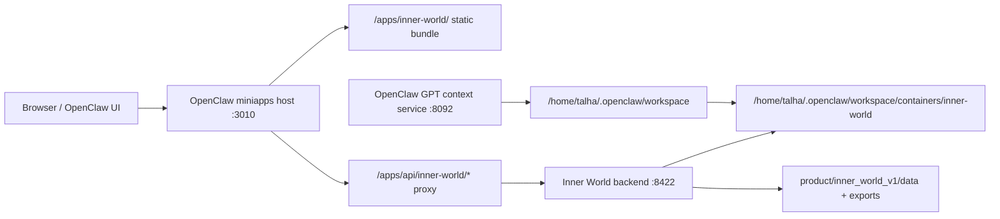

# Inner World OpenClaw Server Architecture

## Summary

Inner World should run inside OpenClaw as a split deployment:

- static miniapp inside the miniapps host
- private backend service on localhost
- live repo mirrored inside the OpenClaw workspace
- GPT access inherited from the existing workspace-bounded context service

## Topology

## Architectural Decisions

### 1. Repo lives under `containers/inner-world`

Reason:

- it matches the existing workspace structure
- it keeps Inner World readable to the GPT context service without new exposure rules
- it makes the deployment feel like a first-class OpenClaw subsystem rather than an external sidecar

### 2. Static app and backend are separated

Reason:

- the miniapps host is already the canonical web surface
- Inner World already has a static frontend bundle
- the backend should stay private and only be reachable through the host proxy

### 3. GPT access is inherited, not reinvented

Reason:

- the existing GPT context service already exposes workspace-bounded `repo/*` endpoints
- once Inner World is mirrored into the workspace, GPT can read it through the same service
- this avoids building a second repo-read bridge

### 4. The backend stays on localhost

Reason:

- the miniapp only needs a proxied API
- the GPT context service already handles external repo access
- keeping the backend private reduces accidental surface area

### 5. The server boots from synced state

Reason:

- the repo mirror already includes `product/inner_world_v1/data` and `exports`
- rebuilding the entire graph before binding the port makes service startup too slow and fragile
- production boot should serve the last known good state first, then allow explicit refresh flows later

## Runtime Surfaces

### Miniapp host

- service:
  - `openclaw-miniapps.service`
- listens on:
  - `127.0.0.1:3010`
- public path:
  - `/apps/inner-world/`

### Inner World backend

- service:
  - `inner-world.service`
- listens on:
  - `127.0.0.1:8422`
- supports:
  - `/api/*`
  - `/apps/api/inner-world/*`

### GPT context service

- service:
  - `openclaw-gpt-context.service`
- listens on:
  - `127.0.0.1:8092`
- public base:
  - `https://openclaw-gpt.talhaslaboratory.xyz`

## Repo Shape On Server

The deployed repo should preserve these paths:

- `src/conversation_os/`
- `product/inner_world_v1/`
- `tools/`
- `docs/plans/`
- `ops/systemd/`

The backend relies on local product data and exports under:

- `product/inner_world_v1/data/`
- `product/inner_world_v1/exports/`

## Request Flow

1. user opens `/apps/inner-world/`
2. miniapps host serves static bundle
3. frontend calls `/apps/api/inner-world/feed`
4. miniapps host proxies to `127.0.0.1:8422/feed`
5. backend reads the live repo data and returns feed JSON
6. GPT, separately, can read the same repo files through the workspace-bounded context service

## Why This Shape Fits OpenClaw

- it preserves OpenClaw as the routing and exposure substrate
- it keeps Inner World as a product layer inside that substrate
- it reuses the existing GPT context service instead of bypassing it
- it keeps deployment reversible and inspectable
