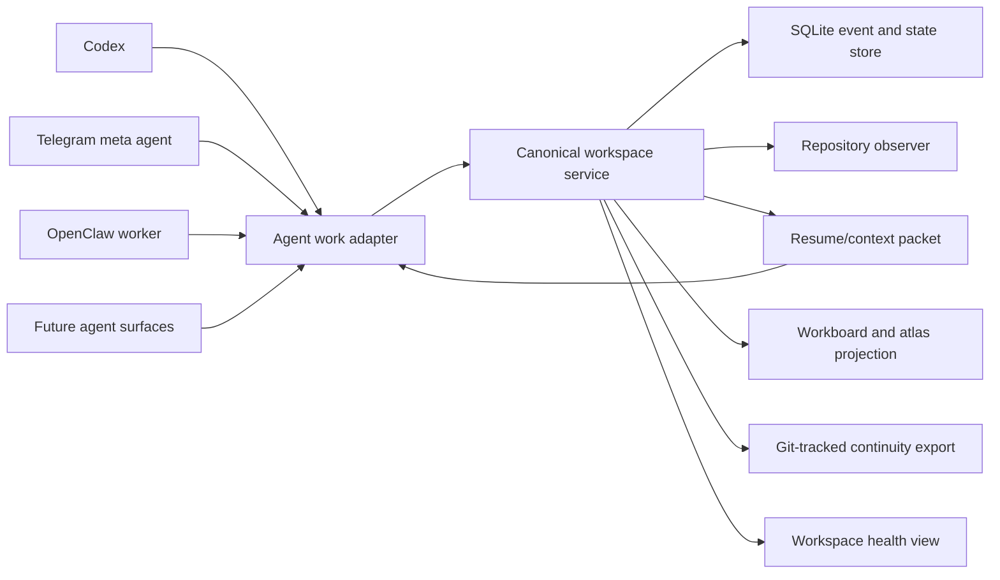
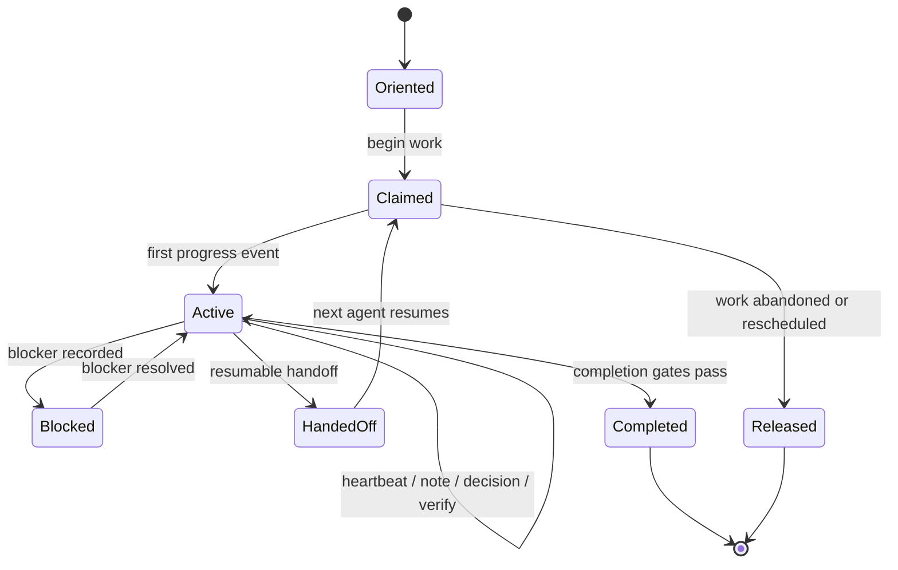

# Reliable Cross-Agent Holodeck Work System

Date: 2026-07-11  
Status: Phase 0 core, Phase 1 service-management slice, Phase 2 run lifecycle core, and initial Phase 3 reasoning records implemented  
Product scope: `#meta` / workspace coordination  
Primary owner: unassigned  
Related system: `docs/implementation/workspace-coordination/README.md`

## Purpose

Make every Holodeck slice and task reliably resumable across agents, surfaces, machines, and time.

The system succeeds when an agent can enter an active task and determine, without reading the original chat:

- what outcome the workspace and task are pursuing
- what is in and out of scope
- who is working on each task and file surface
- what has changed, why it changed, and what evidence supports it
- what remains open, blocked, uncertain, or risky
- what the next safe action is

The desired operating invariant is:

> Every meaningful agent action leaves canonical workspace state more current, more inspectable, and easier for another agent to resume.

## Current Position

The repository already contains most low-level coordination primitives:

- a file and SQLite workspace-store boundary
- a canonical workspace HTTP service
- tasks and first-class subtasks
- claims with path-overlap detection and expiry
- blockers, decisions, tests, activity events, handoffs, and completion gates
- task-first context packets
- repository observation and generated workspace/workboard projections
- CLI, Telegram, and service-client adapters
- backup, restore, readiness, and private-tunnel deployment support

The remaining problem is integration and enforcement. Agents can use the system, but they are not consistently required to. Local file workspaces and the configured remote service can expose different workspace catalogs. Reasoning is distributed across activity events, decisions, and chats. Human-readable continuity bundles can drift from runtime state. No universal agent lifecycle guarantees orientation, claims, periodic progress, and handoff.

## Product Guarantees

The finished system must provide six guarantees.

### 1. Single authority

Connected agents read and mutate one canonical workspace service. A service failure is visible and never causes a silent local write.

### 2. Durable provenance

Tasks, notes, decisions, evidence, claims, and handoffs identify the workspace, task, agent, surface, session, source revision, and time.

### 3. Safe concurrent work

Agents claim bounded task and path scopes before editing. Claims have heartbeats, expiry, overlap checks, and explicit release or handoff.

### 4. Resumability

Every active task has a bounded resume packet containing current scope, hierarchy, reasoning, evidence, repository state, and the next safe action.

### 5. Truthful progress

Progress is derived from canonical events and verification. A task cannot appear complete solely because an agent says it is complete.

### 6. Durable portability

Canonical service state produces readable and git-trackable continuity exports without making those projections competing sources of truth.

## Considered Approaches

### A. Git-tracked workboards as the primary store

This is portable and readable, but weak for live concurrency. Claims, leases, event ordering, and simultaneous writes become merge-conflict problems. It also encourages agents to edit projections independently.

### B. Canonical service with generated projections — recommended

SQLite-backed service state remains authoritative. All agent surfaces use the same API. Markdown, atlas, context packets, and continuity bundles are derived outputs. This builds on the current implementation and keeps concurrency rules deterministic.

### C. Distributed local-first workspace replicas

Each device writes locally and later merges operation logs. This supports offline mutation, but requires stable global identities, causal ordering, conflict resolution, and reconciliation UX. It should be reconsidered only after the central workflow is reliable.

## Target Architecture



The agent work adapter is a shared protocol, not necessarily one process. Each surface may implement it natively, but it must preserve the same lifecycle and contracts.

## Canonical Agent Lifecycle



### Orient

Before edits, the adapter requests a task resume packet. It verifies workspace identity, task hierarchy, current claims, repository freshness, and source revision.

### Claim

The agent declares its task, intent, and paths. The service rejects conflicting claims. A claim receives a lease and heartbeat deadline.

### Plan

The agent records a bounded execution plan as task-local reasoning. Subtasks are created only when work can be independently assigned, blocked, verified, or handed off.

### Work

The adapter records meaningful changes rather than every command or thought. Required records include decisions, scope changes, discoveries that alter the plan, blockers, and verification evidence.

### Handoff or complete

An unfinished exit requires a handoff with current state and next action. Completion requires evidence, residual risks, closed children, no active blockers, and released claims.

## New and Extended Contracts

### Agent identity

Every mutation carries:

```json
{
  "agent_id": "codex",
  "device_id": "talha-macbook",
  "surface": "codex",
  "session_id": "session-...",
  "run_id": "agent-run-..."
}
```

`device_id` identifies the machine or deployment. `run_id` identifies one bounded attempt at a task. Neither replaces the user-facing agent identity.

### Agent run record

Add an append-only `agent_runs` record family:

```json
{
  "run_id": "agent-run-...",
  "workspace_id": "sol-context-frames",
  "task_id": "TASK-012a",
  "actor": {},
  "status": "active",
  "started_at": "...",
  "last_heartbeat_at": "...",
  "source_revision": "...",
  "intent": "Declare workspace artifact roots",
  "claimed_paths": [],
  "ended_at": null,
  "end_reason": ""
}
```

### Reasoning record

Add an append-only `reasoning_records` family. It stores compact work-relevant cognition, not hidden chain-of-thought or raw transcripts.

Allowed kinds:

- `observation`
- `hypothesis`
- `decision`
- `tension`
- `discovery`
- `scope_change`
- `next_action`

Required fields:

```json
{
  "reasoning_id": "reasoning-...",
  "workspace_id": "...",
  "task_id": "...",
  "run_id": "...",
  "kind": "decision",
  "summary": "Use the service as the only connected write authority.",
  "rationale": "Local fallback creates split-brain workspace state.",
  "source_refs": [],
  "confidence": 0.9,
  "created_at": "..."
}
```

### Progress snapshot

Progress must be computed from task events, subtasks, blockers, claims, and tests. Optional percentage values may be displayed but cannot be canonical user-entered truth.

For each task, derive:

- lifecycle status
- completed and open child counts
- active agent runs and claims
- verification readiness
- blocker state
- last meaningful update
- repository freshness
- handoff readiness

### Resume packet

Extend the current context packet with:

- agent-run identity and lease state
- parent and child task relationships
- recent reasoning records
- unresolved tensions and scope changes
- current repository revision and drift since the last run
- required verification and completion gaps
- one explicit `recommended_next_action`

The packet remains bounded. It links to deeper records rather than embedding full histories.

## Canonical Storage and Offline Policy

### Connected mode

- The workspace service is the only write authority.
- Every surface must send mutations through the service client.
- A missing or unknown workspace is an error requiring selection, import, or creation.
- Service failure stops workspace mutation and is surfaced to the user.

### Offline mode in the first release

- Offline access is read-only through the latest continuity export.
- Agents may prepare a proposed handoff or patch outside canonical state, but it is not presented as a claim or progress update.
- Reconnection requires refreshing the resume packet and revalidating conflicts before work is recorded.

This avoids premature distributed reconciliation. An append-only offline operation queue can be designed later if read-only offline access proves insufficient.

## Projection and Continuity Rules

The service produces four derived surfaces:

1. **Resume packet** — machine-oriented, bounded, current task context.
2. **Workspace atlas** — structured workspace status and health.
3. **Workboard** — human-readable tasks, hierarchy, decisions, blockers, and handoffs.
4. **Continuity export** — versionable cross-device package containing the manifest, current state summary, reasoning index, evidence references, and resume instructions.

Each projection must contain:

- source workspace id
- canonical service revision or export sequence
- generated timestamp
- source repository revision
- a warning that the projection is not writable canonical state

Projection generation must be idempotent and must not trigger repository-observer loops.

## Workspace Health

Add a derived health report with machine-readable codes and human-readable remedies.

Minimum conditions:

- `canonical_service_unavailable`
- `workspace_catalog_divergence`
- `repository_unobserved`
- `repository_snapshot_stale`
- `claim_expired`
- `claim_heartbeat_stale`
- `task_without_owner`
- `active_task_without_run`
- `run_without_recent_update`
- `completion_without_verification`
- `handoff_missing_next_action`
- `continuity_export_stale`
- `projection_revision_mismatch`

Health warnings do not all block work. Release and completion gates declare which health codes are blocking.

## Implementation Roadmap

### Phase 0 — Normalize contracts and inventory state

Goal: establish one vocabulary and identify existing divergence before migration.

Tasks:

- `CAW-001` — define canonical task, test, and workspace status vocabularies
- `CAW-002` — add a workspace catalog endpoint with store revision and workspace summaries
- `CAW-003` — audit local file workspaces versus the canonical SQLite catalog
- `CAW-004` — produce an import, archive, or reject decision for every divergent workspace
- `CAW-005` — add contract-version fields and migration fixtures

Exit criteria:

- status terms such as `completed`/`done` and `passed`/`passing` are reconciled
- every active workspace has one declared canonical location
- migration is repeatable and backed up

Implementation note (2026-07-11): the initial catalog, audit, and migration module is available through `tools/workspace_catalog.py`; it normalizes copied legacy task/test values, reports catalog divergence, refuses conflicting targets, and requires an explicit backup before mutating a nonempty SQLite target. The workspace service was deployed and `sol-context-frames` was imported as the first live pilot; its local and canonical revisions now match.

### Phase 1 — Complete canonical-service cutover

Goal: prevent split-brain writes across devices and surfaces.

Tasks:

- `CAW-101` — add workspace create/import/list/archive service operations
- `CAW-102` — require explicit connected or offline mode in clients
- `CAW-103` — remove implicit file writes from connected Codex, Telegram, and OpenClaw paths
- `CAW-104` — add stable service revision and mutation idempotency keys
- `CAW-105` — add end-to-end cross-device catalog and mutation tests

Exit criteria:

- the same workspace catalog is visible from every configured device
- service failures never mutate local fallback state
- duplicate retries do not duplicate events

Implementation note (2026-07-11): the service and client now support catalog, create, snapshot import, and archive operations. Imports normalize legacy status values, refuse divergent target state, are idempotent for matching snapshots, and automatically back up a nonempty SQLite service before mutation. The coordination CLI now selects connected authority by default unless a local root is explicitly used offline, and canonical mutations support persisted idempotency keys. Full surface-wide enforcement remains pending.

### Phase 2 — Add the universal agent-run lifecycle

Goal: make coordination automatic whenever an agent works on a task.

Tasks:

- `CAW-201` — implement begin, heartbeat, release, and end agent-run operations
- `CAW-202` — bind claims to agent runs and refresh their leases together
- `CAW-203` — add a reusable agent-work adapter library
- `CAW-204` — integrate the adapter into Codex/CLI, Telegram, and OpenClaw entry paths
- `CAW-205` — add stale-run recovery and claim-expiry tests

Exit criteria:

- every active connected task attempt has an identifiable run
- abandoned work becomes visible through deterministic expiry
- agents cannot begin conflicting path work without an explicit override

Implementation note (2026-07-11): durable agent runs now support begin, heartbeat, list, end, derived stale-state detection, and explicit stale-run recovery through the service, client, CLI, and task context packet. Recovery records an explicit released end state and frees only linked claims. A reusable connected-work adapter now bundles begin, heartbeat/update, and handoff. Surface-specific automatic invocation remains pending.

### Phase 3 — Add reasoning and progress records

Goal: preserve the work’s evolving rationale without storing raw internal reasoning.

Tasks:

- `CAW-301` — implement reasoning-record storage and service operations
- `CAW-302` — define when adapters must emit decision, discovery, scope-change, and next-action records
- `CAW-303` — derive progress state from canonical events
- `CAW-304` — include reasoning and progress in task preparation/context packets
- `CAW-305` — add provenance, ordering, and bounded-packet tests

Exit criteria:

- another agent can explain the current approach and its evidence from the packet alone
- progress is traceable to events rather than an unsupported percentage
- packets remain within their configured context budget

Implementation note (2026-07-11): typed reasoning records now support observations, hypotheses, decisions, tensions, discoveries, scope changes, and next actions. They are stored append-only, attached to a task and optional run, source-linked, confidence-bounded, exposed by the service/client/CLI, and included in bounded task context packets. Derived progress now reports evidence-based task state, child completion, claims, runs, blockers, verification, recent activity, and a recommended next action. Adapter emission rules remain pending.

### Phase 4 — Make handoff and continuity automatic

Goal: make every pause or surface transition resumable.

Tasks:

- `CAW-401` — extend handoff with run, revision, reasoning, and next-action fields
- `CAW-402` — generate continuity exports from canonical state
- `CAW-403` — publish exports to declared git-tracked workspace paths
- `CAW-404` — add export revision markers and stale-projection warnings
- `CAW-405` — test resume across Codex, Telegram, and OpenClaw simulations

Exit criteria:

- a fresh agent can resume without the original conversation
- generated docs cannot silently outrank canonical service state
- stale exports are clearly detectable

### Phase 5 — Add workspace health and portfolio visibility

Goal: make coordination failures and multi-workspace load immediately visible.

Tasks:

- `CAW-501` — implement health evaluation and blocking-policy configuration
- `CAW-502` — generate cross-workspace task and agent-run summaries
- `CAW-503` — add a small read-only portfolio/board surface
- `CAW-504` — add filters for owner, workspace, status, blockers, and stale work
- `CAW-505` — add operational alerts for stale claims and failed continuity exports

Exit criteria:

- a coordinator can see active agents, conflicts, blockers, and stale work across all workspaces
- every warning links to a concrete remediation

### Phase 6 — Optional governed planning automation

Goal: propose task decompositions and corrective work after the coordination substrate is reliable.

Tasks:

- `CAW-601` — generate proposed task/subtask plans from accepted workspace objectives
- `CAW-602` — propose reprioritization from blockers, dependencies, and verification state
- `CAW-603` — require approval before activating or assigning generated work
- `CAW-604` — evaluate plan quality and semantic continuity against workspace goals

This phase does not include unscoped autonomous agent spawning or production deployment authority.

## Next Scoped Execution Runs

The remaining work should proceed as four bounded runs. Do not begin a later run until the preceding run's acceptance checks pass.

### Run A — Canonical pilot cutover (`CAW-R1`)

Purpose: make `sol-context-frames` the first real canonical workspace, rather than only a locally tested migration fixture.

Scope in:

- deploy the already implemented workspace-service changes to the private canonical host
- back up the canonical SQLite store
- compare the local file catalog with the live service catalog
- import `sol-context-frames` through the service's backup-backed import endpoint
- declare its artifact roots, capture a repository snapshot, and record the migration decision
- verify the same workspace revision from local Codex and Telegram service paths

Scope out:

- migrating every legacy workspace
- changing feature code in the bridge or product surface
- automatic task planning or broad dashboard work

Acceptance checks:

- live catalog shows `sol-context-frames` exactly once
- repeated import is idempotent
- local and service revisions match after migration
- a current context packet contains repository state and a recommended next action
- no file-backed fallback mutation occurs while connected

### Run B — Surface lifecycle completion (`CAW-R2`)

Purpose: make the agent-run contract the normal entry and exit path for each connected surface.

Scope in:

- wire the adapter into the OpenClaw worker entry path
- use the adapter for Telegram builder heartbeats and handoffs, not only run creation
- adopt `tools/workspace_work.py` as the Codex/terminal work entry wrapper
- add a small integration contract for surface identity, session identity, source revision, and idempotency keys
- run one handoff simulation across Codex, Telegram, and OpenClaw

Scope out:

- invisible desktop hooks inside the Codex application
- arbitrary background agent spawning
- changing how users approve deployments

Acceptance checks:

- each connected surface starts a run before claiming/editing work
- every handoff contains run id, source revision, next action, and released claims
- stale recovery safely frees only linked claims
- the three-surface simulation ends with one coherent context packet

Implementation note (2026-07-11): the live simulation initially showed that packets contained only `active_runs`; once a handoff closed its run, its surface provenance disappeared from the packet. Packets now include a bounded, task-scoped `orientation.recent_runs` trail (12 closed/stale runs maximum) in addition to `active_runs`. The runs endpoint remains the full audit authority. This preserves the handoff chain without allowing context packets to grow without bound.

Validation note (2026-07-11): `CAW-R2-SIM` is complete in the canonical `sol-context-frames` workspace. The live service recorded a single Codex → Telegram → OpenClaw sequence, explicit next actions at each transfer, a passing verification record, and all three closed runs in the final context packet. This validates the shared lifecycle contract; it does not by itself prove that every production worker entrypoint invokes it.

### Run C — Continuity export (`CAW-R3`)

Purpose: make a workspace portable across devices and foreign agents without making Markdown a competing source of truth.

Scope in:

- generate a versioned continuity export from canonical state
- include manifest, task hierarchy, active/recent runs, compact reasoning, evidence, progress, and resume instructions
- write export revision/source revision markers
- publish to the workspace's declared git-tracked continuity path
- detect and report stale exports

Scope out:

- copying full chat transcripts by default
- bidirectional edits from the export into canonical state
- automatic commits or pushes

Acceptance checks:

- a fresh agent can resume a task from one export plus the current repository
- export revision matches the service at generation time
- a changed service revision makes the prior export visibly stale

### Run D — Health and cross-device proof (`CAW-R4`)

Purpose: prove the system remains safe when agents, devices, retries, and failures overlap.

Scope in:

- derive workspace health codes for stale runs, stale exports, missing snapshots, active blockers, and unverified completion
- add a read-only cross-workspace health summary
- execute the documented three-agent/two-device simulation
- exercise retry, overlap, service interruption, backup/restore, and stale-run recovery paths

Scope out:

- a full Jira-style visual product
- autonomous reprioritization or assignment
- public network exposure of the service

Acceptance checks:

- every health warning has a concrete remediation
- no simulation produces split workspace state or duplicate events
- recovery preserves the handoff and evidence trail

## Verification Strategy

### Contract tests

- identity fields are required and stable
- event retries are idempotent
- task/subtask and completion invariants hold
- reasoning records preserve source references and permitted kinds
- projections declare canonical revisions

### Concurrency tests

- two agents cannot claim overlapping paths without override
- heartbeat refresh preserves an active claim
- stale runs expire predictably
- simultaneous non-overlapping work remains valid

### Cross-device simulations

- device A creates a task; device B sees and claims it
- device A cannot claim an overlapping path
- device B records reasoning and hands off
- device C resumes from the generated packet and current repository revision

### Failure tests

- service unavailable with no local mutation
- retry after timeout without duplicated events
- stale continuity export detected
- repository drift detected between handoff and resume
- parent completion rejected with open subtasks
- completion rejected without evidence or residual-risk declaration

### Recovery tests

- backup, integrity check, restore, and service restart preserve event order
- expired claims can be safely reclaimed
- interrupted projection generation is idempotently rebuilt

## Rollout Plan

1. Deploy schema additions behind feature flags.
2. Inventory and back up current file and SQLite workspaces.
3. Migrate one active workspace, preferably `sol-context-frames`, as the pilot.
4. Connect Codex and Telegram to the same pilot catalog.
5. Run a three-agent handoff simulation across two devices.
6. Compare canonical state, context packet, workboard, and continuity export.
7. Fix contract and health failures before migrating remaining active workspaces.
8. Enable lifecycle enforcement for all connected workspace mutations.
9. Keep autonomous plan generation disabled until phases 0–5 pass acceptance.

## Pilot Scenario

Use `sol-context-frames` to validate the full system:

1. Import or reconcile it into the canonical service.
2. Normalize its historical `completed` task and `passed` test values.
3. Declare artifact roots and capture a repository snapshot.
4. Create a parent closure task with independently verifiable subtasks.
5. Have Codex claim and work one subtask.
6. Record a decision and discovery, then hand off through the service.
7. Resume from another agent surface or device.
8. Complete all children, satisfy the parent gate, and generate a continuity export.
9. Confirm that all projections report the same source revision and canonical sequence.

## Success Metrics

- 100% of connected task mutations reach the canonical service
- 0 silent local fallback mutations
- 100% of active claims linked to a live or expired agent run
- 100% of handoffs include a next action and repository revision
- 100% of completed tasks have verification evidence and residual-risk records
- a fresh agent can identify the next safe action from one resume packet
- stale claims and projections are detected within their configured threshold
- cross-device simulations produce no catalog or task-state divergence

## Non-Goals

- replacing product architecture documents with workspace state
- storing full private chain-of-thought
- turning every small implementation step into a subtask
- building a broad Jira clone before the coordination contracts are reliable
- unapproved autonomous task activation, agent spawning, or deployment
- multi-master offline mutation in the first release

## Definition of Done

This initiative is complete when:

- all active Holodecks are registered in one canonical service
- Codex, Telegram, and OpenClaw follow the same enforced agent lifecycle
- task-local reasoning and progress are durable and bounded
- handoffs can be resumed across agents and devices without hidden chat context
- workboards and continuity bundles are automatically derived and revision-marked
- health reporting detects stale, conflicting, unverifiable, or divergent work
- the pilot and cross-device failure/recovery suites pass

## Immediate Next Action

Finish the remaining `CAW-R2` production-entrypoint adoption: inspect the OpenClaw worker and Telegram builder paths, wire missing begin/heartbeat/handoff calls through `WorkspaceWorkAdapter`, and add focused integration tests. Begin Run C (`CAW-R3`) only after those checks pass.
