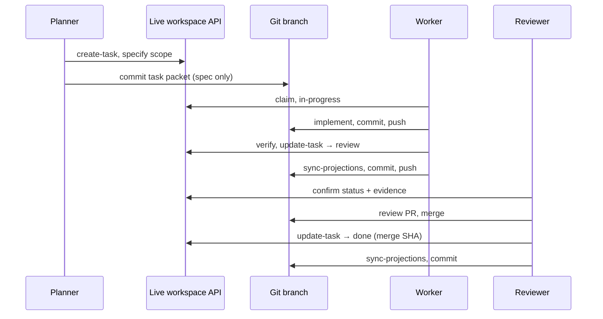

# Workspace Agent Protocol

**Applies to:** every repo using the Conversation OS workspace feature — any `workspace_id`, workboard, or git projection under `docs/workspaces/`.

This protocol prevents coordination drift: live workspace state diverging from git projections that agents read.

---

## Authority model (non-negotiable)

| Layer | Source | Canonical for |
|-------|--------|----------------|
| **Semantics** | Canonical source docs in the workspace (`sources/`, framework papers, product specs) | What things *mean* |
| **Coordination** | Live workspace API (`INNER_WORLD_WORKSPACE_API_BASE`) | Task status, blockers, verification, decisions, runs |
| **Code** | Git branches and commits | Implementation, tests, reviewable diffs |
| **Git projections** | `CONTINUITY.md`, `TASKS.md`, `tasks/*.md`, workboard logs | **Read-only mirrors** for agents without API access |

**Rule:** live API is the **only write path** for coordination. Git projections are **published exports**, never the source of truth for task status.

---

## Mandatory agent boot (every session)

Run before claiming work, searching for boot docs, or trusting task status in markdown:

```bash
cd /path/to/repo
git fetch origin
git checkout main          # or the agreed integration branch
git pull origin main

source ~/.config/inner-space-workspace.env 2>/dev/null || true

# 1. Live workspace first
python3 tools/workspace_coordination.py context \
  --workspace-id <workspace-id> \
  --agent-id <agent-id> --surface <surface> --session-id <session-id>

# 2. Verify git projections match live (must print fresh / changed: [])
python3 tools/workspace_projection_sync.py check --workspace-id <workspace-id>
```

If `check` fails or reports `changed` files, run publish (step 3) before trusting git task status.

**Do not** conclude a file is missing until `git pull` completes. Stale clones were the root cause of “file not found” incidents.

---

## Mandatory handoff (after every coordination mutation)

After **any** live workspace mutation — `create-task`, `update-task`, `verify`, `decision`, `blocker`, `resolve-blocker`, `complete`, or `foundation reconcile-ledger`:

```bash
python3 tools/workspace_projection_sync.py publish \
  --workspace-id <workspace-id> \
  --agent-id <agent-id> --session-id <session-id>

# Confirm
python3 tools/workspace_projection_sync.py check --workspace-id <workspace-id>
```

Then commit and push projections so cloud reviewers see the same state:

```bash
git add docs/workspaces/ docs/workboards/
git commit -m "Sync workspace projections for <workspace-id>"
git push origin <your-branch>
```

**Worker agent checklist:** implement on branch → record verification in live API → `sync-projections` → push branch.  
**Reviewer agent checklist:** read live API (or fresh projections on the branch) + code diff — not stale `tasks/*.md` alone.

---

## What `sync-projections` updates

| Path | Action |
|------|--------|
| `docs/workspaces/<id>/CONTINUITY.md` | Republished from live service |
| `docs/workboards/<board>/TASKS.md` | Index table + summary regenerated |
| `docs/workboards/<board>/tasks/*.md` | `Status:` and `Owner:` lines patched |
| `docs/workboards/<board>/lanes/<status>/` | Lane copies aligned to live status |
| `docs/workboards/<board>/UPDATES.jsonl` | Append-only `projections_synced` event |

Commands:

```bash
# Generic (any workspace with docs/workspaces/<id>/manifest.json)
python3 tools/workspace_projection_sync.py publish --workspace-id <workspace-id>
python3 tools/workspace_projection_sync.py check --workspace-id <workspace-id>

# Foundation workspace shorthand
python3 tools/conversation_os.py foundation sync-projections
python3 tools/conversation_os.py foundation sync-projections --check
```

`foundation reconcile-ledger` runs `sync-projections` automatically after a successful connected reconcile.

---

## Prohibited actions

| Do not | Why |
|--------|-----|
| Hand-edit `Status:` in `tasks/*.md` or rows in `TASKS.md` | Creates lying projections; use live API + sync |
| Treat git task status as merge approval without live confirmation | Audit blocked merges on this exact failure mode |
| Skip `git pull` before searching for workspace docs | Boot docs may exist on `origin/main` but not locally |
| `git add -A` without checking `git status --short \| wc -l` | Mass staging of `runtime/`, `node_modules`, etc. blocks pulls |
| Mark tasks `done` in git only | Record `done` in live API with merge SHA as evidence |
| Run `git stash pop` after recovery without reviewing diff | Reintroduces stale projections onto a clean tree |

---

## Multi-agent workflow (ordered)



---

## New workspace setup (repo maintainer)

When adding a workspace to any project:

1. Create `docs/workspaces/<workspace-id>/manifest.json` with:
   - `workspace_id`, `workboard`, `continuity_projection`
   - optional `sync_contract` path
2. Register live workspace in the coordination service.
3. Copy [`templates/sync-contract.template.md`](./templates/sync-contract.template.md) to `derived/sync-contract.md` and fill in ids.
4. Add row to [`INDEX.md`](./INDEX.md).
5. Point workboard `AGENTS.md` at this protocol.
6. Document workspace-specific boot in the workboard README — **link here for universal rules**.

---

## Connectivity

Configure once per machine:

```bash
# ~/.config/inner-space-workspace.env
INNER_WORLD_WORKSPACE_API_BASE=https://<tailnet-host>/workspace
```

Cloud agents without tailnet: run `bash tools/setup_cursor_tailnet.sh` (requires `TAILSCALE_AUTHKEY`), then retry.

If API is unreachable, coordination commands return `mode: offline` with a manual command list. **Do not** treat offline git projections as current.

---

## Stale projection symptoms

| Symptom | Likely cause | Fix |
|---------|--------------|-----|
| `tasks/*.md` says `blocked`, live says `review` | Missing `sync-projections` | `publish` + commit |
| `CONTINUITY.md` old blocker text | Missing republish | `publish` |
| Agent cannot find boot doc | Stale `main` | `git pull` |
| `git pull` blocked | Mass staged generated files | backup branch or stash, then pull |
| `check` returns `fresh: false` | Projections behind live | `publish` |

---

## Related docs

- [`README.md`](./README.md) — workspace index
- [`INDEX.md`](./INDEX.md) — registered workspaces
- [`../cross-agent/README.md`](../cross-agent/README.md) — foreign agent entry
- Per-workspace `derived/sync-contract.md` — workspace-specific paths
