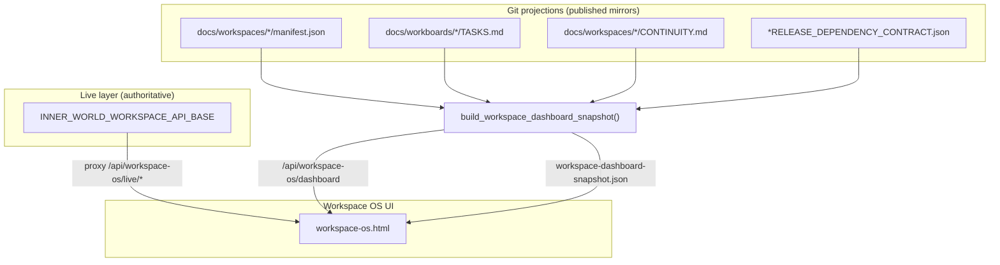

# Workspace OS — synced dashboard

The **Workspace OS** is a browser dashboard for the Conversation OS workspace / workboard system. It visualizes program workspaces, task lanes, release contracts, and continuity freshness from git projections, with optional live API overlay.

## Open the UI

**Via Inner World miniapp (recommended):**

```bash
python3 tools/run_inner_world_miniapp.py
# open http://127.0.0.1:<port>/workspace-os.html
```

**Static file (offline snapshot only):**

Open `product/inner_world_v1/miniapp/workspace-os.html` — falls back to `workspace-dashboard-snapshot.json` if the API route is unavailable.

## Data layers



| Mode | Source | When |
|---|---|---|
| **Snapshot** | Regenerated from git on each API call | Default; works without tailnet |
| **Live overlay** | Proxied workspace service | When `INNER_WORLD_WORKSPACE_API_BASE` is set on the miniapp server |
| **Static fallback** | Committed `workspace-dashboard-snapshot.json` | Opening HTML without miniapp server |

## Refresh snapshot file (for git commit)

```bash
python3 tools/build_workspace_dashboard_snapshot.py
git add product/inner_world_v1/miniapp/workspace-dashboard-snapshot.json
```

Run after `workspace_projection_sync.py publish` so the dashboard file matches workboard mirrors.

## UI regions

| Region | Shows |
|---|---|
| **Program tree** | Parent/child workspaces (UMF hierarchy) |
| **Task lanes** | backlog → done columns from `TASKS.md` |
| **Detail** | Goal, sync line, G5 release SHA, doc links |
| **Live panel** | Blockers / open threads when API reachable |

## Related docs

- [`WORKSPACE-AGENT-PROTOCOL.md`](./WORKSPACE-AGENT-PROTOCOL.md)
- [`INDEX.md`](./INDEX.md)
- [`unified-framework-synthesis/derived/program-workspace-hierarchy-plan.md`](./unified-framework-synthesis/derived/program-workspace-hierarchy-plan.md)
