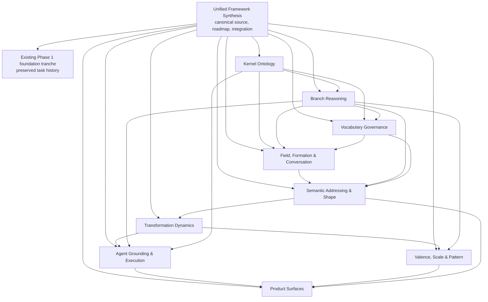

# Unified Metaphysical System — Program Workspace Hierarchy Plan

**Status:** Proposed operating model  
**Date:** 2026-07-15  
**Parent workspace:** `unified-framework-synthesis`  
**Normative source:** `sources/thought-tube-unified-metaphysical-modeling-framework-v1.1.md`  
**Coordination authority:** live workspace API  
**Code authority:** Git  

## 1. Decision summary

Use `unified-framework-synthesis` as the permanent parent workspace and semantic center of gravity. Preserve its completed Phase 1 work and task history in place. Organize the remaining translation of the framework into nine stable child program workspaces, each with its own workboard, gates, decisions, artifacts, and verification evidence.

The hierarchy is logical rather than filesystem-deep:

- the parent owns the canonical paper, system roadmap, cross-program decisions, dependency graph, integration gates, and release truth;
- each child owns one coherent implementation jurisdiction;
- live workspace records own task state;
- Git manifests and workboards publish that state for agents and humans;
- children reference the canonical paper by section and do not copy or reinterpret it as a new authority.

Do not migrate or recreate the five existing foundation tasks. They are the historical foundation tranche and remain stable evidence. Do not create a workspace for every feature or phase. The nine programs are durable jurisdictions; phases, features, and defects are tasks inside them.

## 2. Intended outcome

This operating model must let multiple agents build the framework concurrently without turning it into disconnected subsystems. At any moment, it should be possible to answer:

1. Which framework obligations are implemented, partially implemented, or missing?
2. Which workspace owns each obligation?
3. What must be stable before a downstream program can proceed?
4. What evidence justifies a program's status?
5. Which code, schemas, tests, decisions, and releases implement the canonical paper?
6. How does a local or cloud agent resume work without reconstructing history from chat?

## 3. Authority model

| Concern | Authority | Rule |
|---|---|---|
| Philosophical and formal meaning | Framework v1.1 | A child may clarify an ambiguity through a parent decision record; it may not silently redefine the paper. |
| Cross-program architecture | Parent workspace | Kernel/profile/application boundaries and shared contracts are decided here. |
| Task status, blockers, verification | Live workspace API | Markdown status is a projection, never hand-edited. |
| Code and schema truth | Git | A task cannot be complete without exact commit or merge evidence. |
| Program implementation detail | Owning child workspace | The child decomposes and verifies its jurisdiction. |
| Published agent context | Workspace manifests, workboards, task packs | Refresh after live mutations and push to the shared branch. |

The parent is not a second task tracker for child details. It tracks program outcomes and integration readiness. A child is not a separate philosophy. It is a bounded implementation program.

## 4. Topology



Arrows mean “must consume a versioned contract or verified capability from,” not “all work must wait.” Research, fixtures, interface design, and adversarial examples may start early. Runtime implementation cannot claim readiness until its required upstream gates pass.

## 5. Program catalog and ownership

| Workspace ID | Jurisdiction | Primary paper sections | Required upstream programs | Principal outputs |
|---|---|---|---|---|
| `metaphysical-kernel-ontology` | Universal record envelope, kernel concepts, identity/reference, state commitment, profile conformance, lifecycle foundations | §§4–6, 21–25, 29; Phase 2 | Existing Phase 1 tranche | Versioned schemas, invariants, registries, migrations, conformance fixtures |
| `metaphysical-branch-reasoning` | Branch inheritance, contradiction, four-valued support, merge, inference policy, ensembles | §7; §§20, 27.2, 27.16; Phase 1 completion | Kernel ontology | Branch service/runtime, merge contracts, inference traces, contradiction tests |
| `metaphysical-vocabulary-governance` | Vocabulary levels, promotion, mappings, constraints, ontology evolution | §8; §§22, 27.15 | Kernel ontology, branch reasoning | Type registry, non-destructive mappings, promotion records, governance checks |
| `metaphysical-conversation-formation` | Field, Hold, Formation, conversation records, reasoning traces, context, privacy, resurfacing foundations | §8A, §15A; Phases 3–4 and relevant Phase 8 | Kernel, branch, vocabulary | Profile definitions, event/runtime services, context isolation, formation and trace tests |
| `metaphysical-shape-addressing` | SemanticAddress, dimensions/stations/facets, ShapeCore/View/Record, composite and multidimensional shapes | §§9–11; §§20, 25.2–25.3; Phase 5 | Kernel, branch, vocabulary, conversation/formation | Address and shape schemas, derivation service, bounded views, identity and composition tests |
| `metaphysical-transformation-dynamics` | Transformation composite, phases, thresholds, invariants, identity effects, topology mutation, failed transformation | §14; relevant §17; Phases 6–7 | Kernel, shape/addressing | Transformation service, operator contracts, traces, non-movement and identity tests |
| `metaphysical-valence-scale-pattern` | Valence/salience/tension, scale, recursion, pattern comparison, AntiMatch, restricted resurfacing | §§12–13; Phases 7–8 | Branch, shape, transformation | Assessment records, comparison engine, abstention policy, evaluation corpus |
| `metaphysical-agent-execution` | Situated agents, grounding, compilation boundary, ExecutableModelIR, compilation calculus, reaction estimation, runtime adapters | §§15–19; Phases 9–11 | Kernel, branch, transformation; selected shape/pattern contracts | Grounding packets, compiler, IR, validation barriers, one runtime adapter, execution traces |
| `metaphysical-product-surfaces` | Application projections and SDKs for capture, trace, world, shape, transformation, comparison, agents, simulation, curator, bridge, community | §§23, 30–31; Phases 12–13 | Stable contracts from every program used by a surface | Application SDK, projection contracts, reference surfaces, end-to-end acceptance evidence |

### Ownership exclusions

- Only Kernel Ontology may change universal kernel concepts or the universal record envelope.
- Branch Reasoning owns branch semantics; consumers may request changes but may not embed private branch logic.
- Vocabulary Governance owns canonical type evolution; domain profiles may add governed terms but not bypass promotion or mapping rules.
- Profile programs may extend kernel records but may not redefine their semantics.
- Agent & Execution owns the descriptive-to-executable boundary. No other program may make a descriptive record executable by implication.
- Product Surfaces owns projections and user workflows, not parallel stores or product-specific metaphysical kernels.
- Cross-owner changes require a parent decision record and linked tasks in every affected child.

## 6. Parent workboard design

The parent workboard should remain sparse. It contains:

- one program outcome task for each child workspace;
- one system integration and conformance task;
- one release-readiness task per planned framework release;
- cross-program decisions and blockers;
- the dependency graph and coverage matrix;
- links to child workspaces and their latest verified release evidence.

Each program outcome task records only:

- target capability and paper obligations;
- child workspace ID;
- upstream readiness requirements;
- current program health (`not_started`, `active`, `blocked`, `verification`, `integrated`, `released`);
- latest verified child release or merge SHA;
- unresolved cross-program risks.

Parent status must be derived from child evidence. A parent program task cannot become `done` merely because child implementation tasks are closed; the child's integration/release gate must pass.

## 7. Common child workboard template

Every child workboard uses the same durable structure:

```text
docs/workboards/<program>/
  README.md              purpose, scope, owners, dependencies, commands
  TASKS.md               sparse task index projected from live state
  GATES.md               program-specific entry and exit gates
  DECISIONS.md           durable semantic and architectural decisions
  UPDATES.jsonl          append-only event/projection history
  lanes/                 generated lane views
  tasks/                 one detailed task packet per task
  artifacts/             plans, contracts, reviews, verification summaries
```

The standard task decomposition is:

1. **Contract and semantic lock** — paper citations, records, invariants, prohibited interpretations.
2. **Storage and migration** — persistence model, versioning, migrations, historical fixtures.
3. **Runtime operations** — minimal owner module and public operations.
4. **Verification and conformance** — unit, invariant, adversarial, migration, and semantic continuity tests.
5. **Integration and handoff** — downstream contract, examples, documentation, exact merge evidence.

Programs may split these tasks when risk or reviewability demands it. They should not combine semantic lock and broad implementation in one opaque task.

## 8. Gate model

All children use six common gates, supplemented by domain-specific checks:

| Gate | Meaning | Minimum exit evidence |
|---|---|---|
| G0 — Semantic authority | Scope and source obligations are understood | Section-level traceability, explicit unknowns, owner/exclusion check |
| G1 — Contract lock | Public schemas, invariants, and boundaries are reviewable | Versioned contract, compatibility statement, decision records |
| G2 — Persistence and migration | Data survives version and lineage changes | Migration fixtures, rollback/forward behavior, provenance preservation |
| G3 — Runtime behavior | The smallest useful vertical slice works | Public operations, owner-module tests, failure and abstention behavior |
| G4 — Conformance | Meaning survives edge cases and handoffs | Acceptance tests from §27, adversarial cases, semantic continuity evidence |
| G5 — Integration and release | Downstream consumers can safely depend on it | Integration tests, docs/task pack, merge SHA, residual risks |

A gate may be `not_ready`, `in_review`, `passed`, or `superseded`. “Passed” always names the evidence and contract version. Gate regression is permitted and must be recorded when an upstream contract changes.

## 9. Dependency contracts

Every cross-program edge gets a small versioned dependency contract stored by the provider and linked by the consumer. It states:

- provider and consumer workspace IDs;
- public schemas and operations being consumed;
- contract version or Git reference;
- semantic invariants the consumer relies on;
- readiness gate required before runtime use;
- compatibility and migration policy;
- failure, absence, and abstention behavior;
- provider verification and consumer integration tests;
- current owner and unresolved questions.

This prevents a dependency arrow from becoming an informal promise. A consumer can design against a draft contract, but cannot pass G5 against an unverified upstream draft.

The parent should validate that the dependency graph is acyclic. If a genuine feedback loop appears, split the shared contract into the lowest legitimate owner rather than allowing two workspaces to own each other.

## 10. Framework coverage and traceability

Create one parent-level machine-readable coverage registry with one row per normative obligation, not merely one row per paper section. Each row should include:

```json
{
  "obligation_id": "UMF-7.3-FOUR-VALUED-SUPPORT",
  "source_section": "7.3",
  "summary": "Represent support without collapsing contradiction",
  "owner_workspace_id": "metaphysical-branch-reasoning",
  "implementation_refs": [],
  "test_refs": [],
  "status": "unimplemented",
  "uncertainty": null
}
```

Coverage status is one of `unallocated`, `specified`, `implemented`, `verified`, `integrated`, or `deferred_with_reason`. The registry is not a substitute for tasks; it proves that the task system covers the paper and exposes silent omissions.

Each child maintains its own filtered coverage view. The parent owns allocation and cross-program completeness.

## 11. Workspace metadata contract

Register logical hierarchy in Git manifests even before native cross-workspace hierarchy exists in the service:

```json
{
  "workspace_id": "metaphysical-shape-addressing",
  "parent_workspace_id": "unified-framework-synthesis",
  "program_task_id": "UMF-PROGRAM-SHAPE",
  "canonical_source": "../unified-framework-synthesis/sources/thought-tube-unified-metaphysical-modeling-framework-v1.1.md",
  "framework_sections": ["9", "10", "11", "20", "25.2", "25.3"],
  "dependency_workspace_ids": [
    "metaphysical-kernel-ontology",
    "metaphysical-branch-reasoning",
    "metaphysical-vocabulary-governance",
    "metaphysical-conversation-formation"
  ],
  "workboard": "docs/workboards/metaphysical-shape-addressing/README.md",
  "continuity_projection": "docs/workspaces/metaphysical-shape-addressing/CONTINUITY.md",
  "sync_contract": "docs/workspaces/metaphysical-shape-addressing/derived/sync-contract.md"
}
```

Add a `child_workspaces` catalog to the parent manifest. These fields establish discoverability and validation; they do not create a second status authority.

## 12. Rollup and synchronization

### Initial mechanism

Use the existing coordination protocol for every active workspace:

1. `git pull --ff-only`.
2. Query live context for the target workspace.
3. Run projection freshness check.
4. Mutate live task/blocker/verification state.
5. Publish that workspace's projection.
6. Check projection freshness.
7. Commit only the intentional projections and artifacts.
8. Push before handoff.

After a child passes a gate that changes parent health, perform a separate parent live update citing the child workspace, task IDs, contract version, and merge SHA; then publish and push the parent projection. This is an explicit reconciliation step, not dual editing.

### Automation after the first three children

Add a small `workspace_program_rollup.py` tool only after the hierarchy has real data. It should:

- read the parent child catalog;
- query each child from the live API;
- calculate health without mutating child state;
- validate dependency readiness and cycles;
- identify stale projections and missing evidence;
- update parent program tasks only through supported live API operations;
- publish affected projections;
- support `check` and `publish` modes, with `check` safe for CI.

Do not encode philosophical semantics in the rollup tool. Its job is coordination integrity.

## 13. Rollout strategy

### Stage 0 — Approve and lock the operating model

- approve the nine jurisdictions and names;
- record the parent/child authority rules;
- define program task IDs and metadata schema;
- freeze migration of existing Phase 1 task history;
- establish the first coverage-registry format.

**Exit:** parent decision record accepted; no ownership ambiguity among the first three programs.

### Stage 1 — Prepare the parent

- add the nine-child catalog to the parent manifest;
- add one parent program outcome task per child;
- add the integration and release tasks;
- publish the program board and dependency map;
- seed the normative obligation registry from framework v1.1;
- tag existing five tasks as foundation-tranche evidence without changing their IDs.

**Exit:** every normative section has a provisional owner and no obligation is hidden.

### Stage 2 — Create the first active children

Create live workspaces and workboards for:

1. `metaphysical-kernel-ontology`;
2. `metaphysical-branch-reasoning`;
3. `metaphysical-vocabulary-governance`.

Seed only contract, verification, and immediate implementation tasks. Build task packs. Confirm local and cloud agents can independently boot, read live state, check projections, and resume work.

**Exit:** the three workspaces complete G0 and their dependency contracts are visible from the parent.

### Stage 3 — Prove the coordination model

- complete one real cross-workspace contract change end to end;
- test blocker propagation and gate regression;
- add `check`-mode rollup validation;
- rehearse a cloud-agent handoff and local-agent resumption;
- audit that no statuses were hand-edited and no task was marked complete without evidence.

**Exit:** hierarchy and sync behavior are proven by actual work, not just scaffolding.

### Stage 4 — Activate semantic profile children just in time

Create Conversation/Formation and Shape/Addressing as their upstream contracts approach G3. Create Transformation and Valence/Scale/Pattern after their required contracts stabilize. Register all nine in the parent catalog from Stage 1, but do not populate inactive live spaces with speculative task inventories.

**Exit:** each activated child has a current task pack, G0 evidence, and explicit upstream versions.

### Stage 5 — Activate execution and product programs

Create Agent/Execution when kernel, branch, and transformation contracts can support grounding and compilation. Product Surfaces may run narrow prototypes earlier behind explicit experimental boundaries, but production surfaces cannot pass integration gates against unstable or duplicated foundations.

**Exit:** at least one vertical path runs from capture through governed modeling to a bounded application projection; executable paths additionally pass the compilation barrier.

## 14. Execution waves and safe parallelism

| Wave | Programs | Safe parallel work | Hard constraint |
|---|---|---|---|
| 0 | Parent operating model | Catalog, coverage seeding, gate templates | No live child sprawl before ownership lock |
| 1 | Kernel ontology | Migration inventory and invariant tests | Universal contracts lock before consumer runtime work |
| 2 | Branch reasoning + vocabulary governance | Both may implement against locked kernel contracts | Vocabulary promotion relying on branch semantics waits for branch contract |
| 3 | Conversation/formation + shape/addressing | Profile contracts, fixtures, UI-independent prototypes | Shape runtime consumes verified identity, branch, and vocabulary behavior |
| 4 | Transformation + valence/scale/pattern | Transformation core and pattern corpus preparation | Causal execution cannot be inferred from valence or resemblance |
| 5 | Agent grounding/execution | Grounding and compilation can proceed as separate tracks | No execution without explicit compilation and validation |
| 6 | Product surfaces | Independent projections against stable SDK slices | No parallel store or product-specific kernel |

## 15. Change-management protocol

When work in one child reveals a required change elsewhere:

1. open a cross-program change record in the parent;
2. identify affected obligations, contracts, migrations, and consumers;
3. create linked tasks in provider and consumers;
4. decide whether the change is additive, breaking, or interpretive;
5. update the canonical paper only if the meaning itself must change;
6. version the provider contract and record compatibility behavior;
7. regress affected gates until verification is restored;
8. update the coverage registry and parent health.

This makes correction normal while preventing silent semantic drift.

## 16. Principal risks and defenses

| Risk | Early signal | Defense |
|---|---|---|
| Nine competing frameworks emerge | Children copy normative prose or redefine common terms | One canonical source, section references, owner exclusions, parent decisions |
| Status drift between local, cloud, and Git | Projection check reports changes; agents cite different tasks | Live API authority, publish/check after mutations, push before handoff |
| Empty workspace sprawl | Many spaces have no active owner or current task pack | Register all in catalog; create/populate live spaces just in time |
| Parent board becomes unreadable | Child implementation tasks appear in parent lanes | One outcome task per child; detail remains in child |
| Premature parallelism | Consumers implement guessed upstream contracts | Draft design allowed; G5 requires verified provider contract |
| Circular ownership | Two children block on each other's private types | DAG validation; move shared contract to lowest legitimate owner |
| Completion inflation | “Done” lacks tests, migrations, or merge evidence | Six gates; parent closes only on child G5 |
| Cross-owner edits bypass review | One task changes several jurisdictions | Parent change record and linked tasks before cross-owner mutation |
| Philosophy disappears into software convenience | Schemas cannot be traced to normative obligations | Obligation registry and section-level conformance evidence |
| Products fork the model | Product-specific records become a parallel canonical store | Projection-only rule and SDK contract tests |
| Rollup automation becomes a hidden authority | Computed status overwrites nuanced state | Live API remains authority; rollup exposes evidence and uses conservative transitions |
| Foundation history is lost | Existing task IDs are recreated or moved | Preserve the current workspace and five-task tranche in place |

## 17. Verification strategy

Verify the operating system at four levels:

1. **Structural:** manifests resolve; parent/child links and workboard paths exist; dependency graph is acyclic.
2. **Coordination:** live state and projections agree; local and cloud agents observe the same revision; task packs identify current work.
3. **Semantic:** every normative obligation has one owner; child contracts cite obligations; no prohibited redefinition occurs.
4. **Delivery:** gate evidence resolves to tests and exact Git revisions; downstream integration tests use public contracts.

Before considering the hierarchy operational, run a two-agent continuity drill:

- Agent A changes a child task and publishes it.
- Agent B starts from a clean pull, finds the child through the parent, reads live state, verifies projection freshness, and resumes without private chat context.
- Agent B completes or blocks the task with evidence, republishes, and updates the parent rollup.
- Agent A confirms the same final state from a fresh context query.

## 18. Success criteria

The workspace system is ready when:

- the parent manifest catalogs all nine programs;
- every normative framework obligation has exactly one accountable owner;
- the first three child workspaces are live, projected, and discoverable;
- each active child has a workboard, gates, decisions, dependency contracts, and current task pack;
- the existing foundation task history is intact;
- local and cloud agents pass the continuity drill;
- dependency and projection checks can run without mutation;
- one cross-program change has passed provider and consumer verification;
- parent health is supported by child evidence rather than manually duplicated status;
- no application owns a parallel source of metaphysical truth.

## 19. Recommended immediate implementation slice

After approval, implement only Stages 1 and 2 plus the non-mutating checks from Stage 3:

1. Add parent catalog and stable program task IDs.
2. Generate the obligation registry from v1.1 and review allocation manually.
3. Create the three foundational child workspaces and standard boards.
4. Link their parent outcome tasks and dependency contracts.
5. Publish, commit, push, and run a local/cloud continuity drill.
6. Use real operating evidence to refine the template before creating the remaining six live spaces.

This slice creates enough structure to coordinate real work while keeping the cost of correcting the operating model low.

## 20. Deliberately deferred work

- Native service-level workspace nesting: metadata and parent tasks are sufficient initially.
- Automatic status mutation across all children: first prove conservative rollup rules with real evidence.
- Detailed task inventories for inactive programs: create them at activation time.
- A new framework version: this plan organizes implementation of v1.1 and does not alter its normative content.
- Broad product delivery: narrow prototypes may test contracts, but product release follows conformance.

